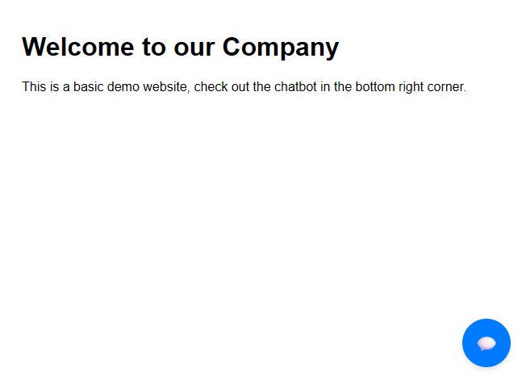
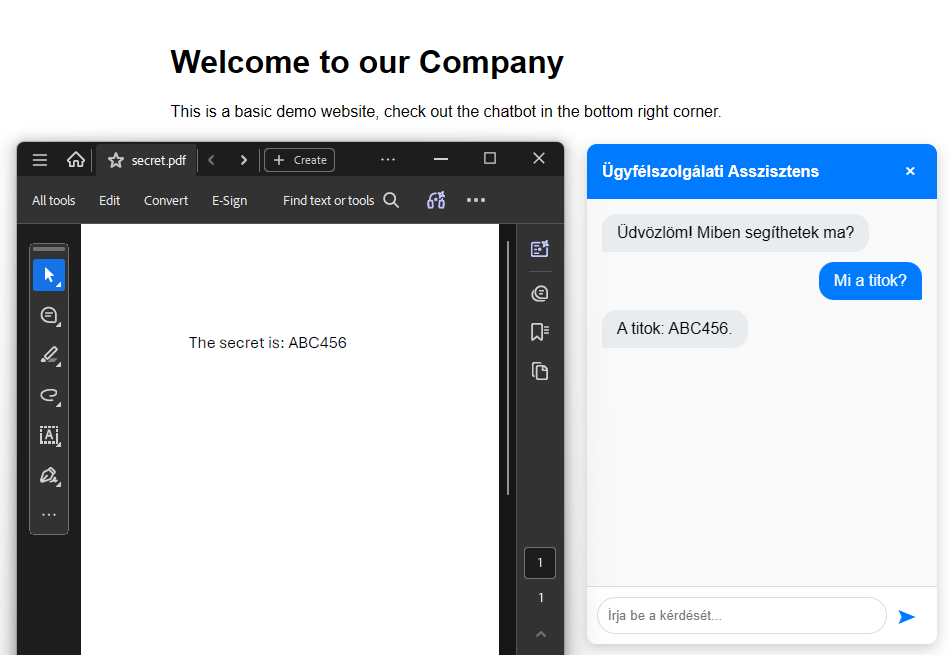

# AI Chatbot
## Individual Project - Cloud Native Application Development
#### This project is an AI chatbot designed to be easily integrated into various websites to fulfill customer support tasks.
### Features:
- RAG (Retrieval-Augmented Generation) for enhanced response accuracy.
- Vector database for efficient data retrieval.
- FastAPI for building the backend API.
- Docker for containerization and easy deployment.
### Technologies Used:
- Python
- FastAPI
- Docker
- Vector Database (PostGreSQL with pgvector extension)
- OpenAI API for LLM interactions
- Microsoft Azure for cloud deployment (Azure Container Apps)
- GitHub Container Registry for storing Docker images

### Setup Instructions:
- docker compose up -d --build (run containers)
- docker compose exec api uv run python db_setup.py (initialize database)

### Screenshots:
#### Widget icon:

#### Chat interface in action:

